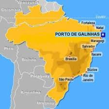
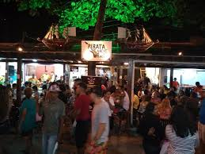
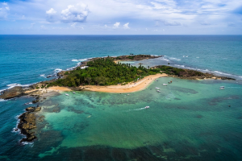
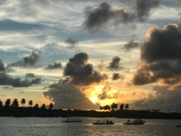
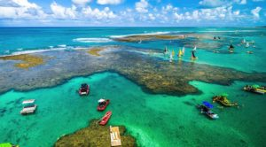

# Tarefas de Mistura Brasileira

## Minha rotina

A minha rotina de todos os dias começa muito cedo. Eu me levanto às 7h, tomo banho, escovo os dentes, me visto e tomo o café de manhã. \
Saio às 8h e chego ao trabalho às 8h45, mas, às vezes, me atraso. Almoço com meus colegas. Depois, volto para casa e merendo com meu marido. \
Logo, dou aulas de informática na universidade até 21h, vejo TV ou falo com minha família pelo computador. À noite, eu janto com meu marido, me deito às 23:30 ou mais tarde, vejo as redes sociais e eu durmo à meia-noite. \
Nos fins de semana, eu me levanto mais tarde e vou dar um passeio com meu marido ou então, nós ficamos em casa

## Minhas férias em Porto de Galinhas - PE

Pelo menos uma vez por ano, geralmente no verão, viajamos com meu marido para o Nordeste brasileiro. Praias lindas e, dependendo do lugar, ótima infraestrutura. Quase sempre nosso destino é Porto de Galinhas, em Pernambuco. Realmente adoramos!

Agora vou contar para vocês umas de essas viagems... \
Do Recife para a Praia de Porto de Galinhas são 65 km, levamos cerca de uma hora e meia para chegar. \
Desde Buenos Aires **reservamos** um quarto duplo na Pousada Tabapitanga, localizada mais precisamente no Pontal do Cupe, não fica bem no centrinho da Vila mas é bem próxima.

[Pousada Tabapitanga](https://tabapitanga.com.br/)

Chegando à Porto de Galinhas, **descobrimos** que a origem de esse nome se deve à venda de escravos de forma clandestina no século XVIII. \
Logo que **passamos** pela entrada da cidade, **fomos** abordados por um senhor muito simpático, que **ofereceu** estacionamento próximo à praia por R$ 5,00 (o dia), além de atender em uma barraca bem localizada na praia. \
As águas de Porto de Galinhas são tranquilas e a vontade é de passar o dia todo no mar. \
**Terminamos** o primeiro dia nas ruas do comércio no centrinho da Vila, que contam com um Centro de Artesanato bem legal, onde é possível comprar lembrancinhas de galinhas para todos os gostos. \
Há muitos restaurantes na Vila, optamos por um lugar chamado Pirata, que vende waffles doces e salgados bem gostosos. \
Seguimos para a Rua do Porto Cult, onde acontecem shows de entretenimento local.

Nosso primeiro passeio pelos arredores de Porto de Galinhas **foi** à Ilha de Santo Aleixo. \
Santo Aleixo fica na cidade de Barra de Sirinhaém, **levamos** cerca de uma hora para chegar até lá... Há dois pontos para visitar na ilha, eu **visitei** um lado da praia onde há muitos ouriços, pedras e corais e Mariano **visitou** outro lado onde há uma gigante piscina natural que também tem corais e é possível fazer snorkel.

**Terminamos** o dia no Pontal de Maracaipe, que é outra praia de Ipojuca, famosa pelo maravilhoso pôr do sol. Eu **tirei** muitas fotos, é um espetáculo fantástico. Vale a pena!

À noite, **fomos** ao Porto Mix, um restaurante de frutos do mar e pizzas que funciona das 9h às 22h e fica de frente ao mar. **Comemos** camarão e **bebemos** muito vinho tinto lembro. \
Outro dia **fizemos** o passeio de jangada às piscinas naturais para mergulhar e observar os peixinhos coloridos. O passeio tem a duração de 1h, os jangadeiros cobram R$ 30,00 ida/volta.

Acho imperdível conhecer essa cidade, o verdadeiro "Caribe Brasileiro". Gostoso recordar desse passeio é uma delícia. Amo esse lugar!
